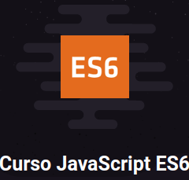
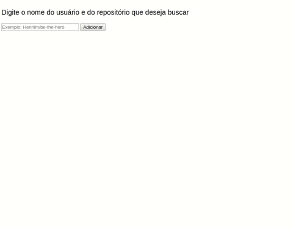

# **JavaScript ES6**

Toda aplicação desenvolvida foi através do curso, da linha *Starter*, da *Rocketseat*

Link do curso: https://rocketseat.com.br/starter/curso-gratuito-javascript-es6

Curso muito importante para se atualizar com as principais funcionalidades das versões mais recentes da linguagem, como: 
- Classes 
- Arrow functions 
- Async/await
- Const 
- let
- Operações em Array com map, filter , reduce e find
- Desestruturação de objetos
- Valores padrão
- Operadores rest/spread
- Template Literals
- Object Short Syntax

Além de utilizar import/export, instalar e configurar Webpack Server

# Sobre a aplicação: #

Essa aplicação lida com a Api do GitHub, realizando uma busca pelo nome do usuário juntamente com o repositório que deseja buscar, retornando o Avatar do Usuário, descrição e link de acesso. Com ela foi abordado grande parte dos conceitos ensinados durante todo o curso.

As requisições para a Api foram feitas utilizando **Axios**

